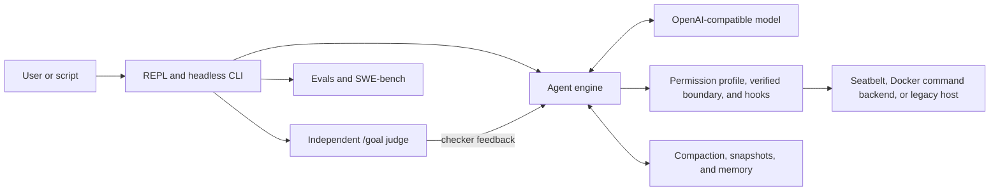

# OpenHarness

<p align="center">
  <a href="README.md"><strong>English</strong></a> ·
  <a href="README.zh-CN.md"><strong>简体中文</strong></a>
</p>

[](https://github.com/maisieyang/build-my-own-harness/actions/workflows/ci.yml)


[](https://github.com/astral-sh/ruff)


> **A local-first control plane for coding agents, built from scratch in Python.**
>
> OpenHarness turns an OpenAI-compatible model into a coding agent, then owns
> the runtime around it: tools, authorization, execution, context, extension,
> recovery, and external completion.

The model supplies intelligence. The harness manages the consequences: what the
model may do, where actions run, which evidence survives the context window,
how domain capabilities are loaded, and who decides that a task is complete.
The central claim of this project is that reliable coding agents are built as
much from these control-plane decisions as from the model itself.

## Evidence snapshot

The figures below are anchored to the CLI-stable baseline at commit
[`9b4375e`](https://github.com/maisieyang/build-my-own-harness/commit/9b4375e)
(2026-08-02), rather than presented as permanently current counters.

| Signal | Current evidence |
|---|---|
| SWE-bench Lite | **170/300 resolved (56.7%)** with qwen3.7-max, thinking off; evaluated with the official SWE-bench evaluator deployed on a self-hosted ECS |
| Test suite | **2,783 collected test items**; stable-core coverage enforced by a **>=95% gate** |
| Static quality | Ruff lint/format and `mypy --strict` across `src/` |
| Compatibility | CI on Python 3.10 and 3.11 |
| Design trace | Boundary decisions, capability plans, dogfood retrospectives, eval artifacts, and benchmark records are committed beside the code |

The benchmark was driven through the shipped `oh` CLI, not a private
benchmark-only agent. The complete campaign record is in
[`benchmarks/swebench/RUNLOG.md`](./benchmarks/swebench/RUNLOG.md), with the
failure analysis in
[`benchmarks/swebench/TAXONOMY.md`](./benchmarks/swebench/TAXONOMY.md) and raw
artifacts under [`benchmarks/swebench/out/`](./benchmarks/swebench/out).

## One-minute tour

Bare `oh` opens the conversation-first REPL. Planning, approval, and execution
are separate state transitions:

```text
>>> /plan Review the implementation and propose a verification plan

plan mode -- approve this plan?
  [1] yes, approve -- return to default mode
  [2] no, keep planning
  [3] no, discard plan mode (back to default)
plan> 1

>>> /goal Implement the approved plan; run `uv run pytest -m 'not integration' -q`; stop after 10 turns
```

`/plan` removes mutation tools at the permission layer. Approval returns control
to the default posture but does not auto-execute. `/goal` starts work and asks
an independent, tool-disabled judge to assess the accumulated evidence after
each assistant turn.

## System model

At the bottom of the repository is one model-driven tool loop:

```python
while True:
    stream = llm.stream(messages)
    tool_calls = parse_tool_calls(stream)
    for call in tool_calls:
        decision = permission_checker.evaluate(call)
        result = execute(call) if decision.allowed else deny(call)
        messages.append(result)
    if stop_reason == "end_turn":
        break
```

Everything else exists because running this loop on a real repository exposes
control problems that the model cannot solve by itself.



The ownership model has four parts:

1. **Actions.** Typed streaming and tool calls feed an allow/ask/deny
   authorization layer, lifecycle hooks, external-effect policy, and—when the
   sandbox posture is selected—one verified session boundary shared by the
   local data-plane tools.
2. **Evidence and state.** Tool results, compaction, memory, and snapshots
   preserve enough trustworthy state for long tasks to recover.
3. **Capabilities.** Skills, commands, mode bundles, MCP servers, plugins, and
   subagents extend the action space without adding new engine dispatch paths.
4. **Completion.** An independent semantic judge owns `/goal`'s stop decision;
   evals measure that mechanism separately from benchmark task performance.

## Context and evidence lifecycle

Long-context work is not solved by making the prompt larger. A coding agent
needs to preserve the evidence that future decisions depend on while discarding
bulk that no longer earns its token cost.

OpenHarness handles that lifecycle at several boundaries:

- tool output is truncated head-and-tail, preserving both identifying context
  and terminal summaries or errors;
- prompt-too-long errors trigger bounded reactive recovery rather than losing
  the turn;
- explicit compaction combines a structured summary with an uncompacted recent
  tail;
- project memory and per-turn checkpoints preserve durable facts separately
  from the raw transcript;
- snapshots and session resume make recovery a persisted state transition
  instead of a prompt convention.

A dogfood run exposed why this is an evidence problem: head-only Bash
truncation removed pytest's final result, leaving the model with no true count
to quote. The model fabricated one and then repeated its own fabrication on the
next turn. The production fix preserved both ends of command output and became
a regression test. See
[`learnings/dogfood-day1-tool-skill.md`](./learnings/dogfood-day1-tool-skill.md)
and [`src/openharness/tools/bash.py`](./src/openharness/tools/bash.py).

## External completion and evaluation

The working model is not allowed to declare its own work correct. `/goal` is
the single completion controller: it preserves one conversation and asks an
independent judge to decide whether another turn is needed. `--auto` remains an
orthogonal permission posture; it does not decide completion.

### Interactive control: `/plan` and `/goal`

`/plan` is a permission-layer clamp, not a prompt convention: `Edit`, `Write`,
and `Bash` are denied, and the model has no tool that can approve itself.
Approval only returns the session to default mode.

`/goal <condition>` starts work immediately. After each assistant turn, the
harness renders the accumulated transcript and sends it to a separate,
tool-disabled LLM call:

```text
working model turn
        |
        v
untrusted transcript --> independent judge --> pass --> persist "met" and stop
                                   |
                                   +--> fail --> append checker feedback
                                                 and continue the same session
```

Judge errors and malformed output fail closed. A hard turn cap bounds false
negatives and provider failures. Goal state is persisted with the conversation,
including terminal sentinels, so `oh chat --resume` does not resurrect work that
was already completed.

### Headless execution and isolation

`oh ask -p` remains the single-run primitive for scripts, benchmarks, and CI.
It runs one prompt and reports the engine's terminal state; it does not own a
second completion loop.

```bash
uv run oh ask -p "inspect the repository and report the highest-risk gap" \
  --output-format json \
  --isolate
```

`--isolate` places that one run in a fresh Git worktree. Sandbox, worktree, and
structured output remain execution primitives rather than alternative owners
of task completion.

### Evaluation ladder

The project separates mechanism tests from model-behavior evidence:

1. Unit and integration tests lock protocol, state-machine, and failure-path
   invariants.
2. Capability evals cover tool choice, error feedback, skill triggering,
   memory, compaction, and completion judging with programmatic scorers,
   cassette/replay, and judge meta-evaluation.
3. SWE-bench exercises the shipped CLI across 300 real repository tasks and
   joins execution records with official verdicts for failure attribution.

The goal-owned completion judge lives in
[`src/openharness/services/goal_judge.py`](./src/openharness/services/goal_judge.py).
Eval datasets and their explicit pass bars live under [`evals/`](./evals).

## Capability substrate and plugin dogfood

Extensions are translated into existing runtime primitives before the model
turn starts. Skills become tool-result evidence, mode bundles compose prompts,
tool catalogs, hooks, and permission overlays, and plugins fan out into the same
stores used by first-party capabilities. The engine does not gain a separate
"plugin execution" path.

The companion
[`finance-skills`](https://github.com/maisieyang/finance-skills) repository is
the vertical proof. A Claude Code-format credit-review plugin containing four
skills was copied into the OpenHarness plugin directory without renaming files
or rewriting its schema. OpenHarness discovered the plugin, translated it into
the common manifest, namespaced its skills, and triggered them through the
existing `LoadSkill` envelope path. The envelope helper itself remained
unchanged across the plugin integration.

That dogfood also forced two honest boundaries:

- an empty-argument synthetic envelope exposed a thinking-provider protocol
  failure; the fix made the message shape provider-neutral instead of adding a
  Qwen-specific branch;
- Claude Code `.mcp.json` entries were not imported because the fixtures use
  HTTP/OAuth while OpenHarness MCP is stdio-only. Discovery reports zero MCP
  servers rather than pretending the transports are compatible.

The design and run evidence are in
[`decisions/39-phase-19-boundary.md`](./decisions/39-phase-19-boundary.md) and
[`learnings/phase-19.md`](./learnings/phase-19.md).

## What the benchmark changed

The SWE-bench campaign was also a harness evaluation. Running all 300 Lite
instances surfaced five concrete control-plane defects or gaps:

- version metadata drifted from the package version;
- child processes silently resolved a different configuration source;
- the error path recommended a `--max-turns` option that did not exist;
- retry policy did not cover mid-stream transport interruption;
- provider-specific request parameters had no generic passthrough path.

The fixes were made in the production path and then reused by the adapter. A
provider changed the model's default thinking behavior during the campaign;
the response was a generic `OPENHARNESS_EXTRA_BODY` passthrough rather than a
Qwen-specific branch.

The strongest behavioral result was not the score: resolved and unresolved
completed runs had very similar turn-count distributions. A model can work for
many turns, produce a plausible patch, and still be wrong. That evidence is why
completion in OpenHarness belongs to an external oracle, never to the working
model's self-report.

## Quick start

Requires Python >=3.10, [uv](https://docs.astral.sh/uv/), and an
OpenAI-compatible Chat Completions endpoint.

```bash
curl -LsSf https://astral.sh/uv/install.sh | sh

git clone https://github.com/maisieyang/build-my-own-harness.git
cd build-my-own-harness
uv sync

cp .env.example .env
$EDITOR .env

uv run oh
```

Set `OPENHARNESS_API_KEY`, `OPENHARNESS_BASE_URL`, and
`OPENHARNESS_MODEL` in `.env`. The defaults target Qwen through DashScope, but
the loop contains no provider-specific branches.

Type `/` in the REPL to open the combined menu of built-ins, user commands, and
skills. An initial prompt can be supplied directly:

```bash
uv run oh "review this repository and identify the highest-risk gap"
```

## Command map

| Command | Purpose |
|---|---|
| `oh` / `oh chat` | Interactive multi-turn session |
| `oh ask` | One-shot or headless execution |
| `oh tools` | Inspect registered tool schemas and metadata |
| `oh config` | Show effective settings or edit the user `.env` |
| `oh hooks` | Inspect framework and plugin hooks |
| `oh memory` | Inspect the per-project memory store |
| `oh plugins` | Inspect installed native and Claude Code-format plugins |
| `oh snapshot` | List, show, and garbage-collect conversation snapshots |
| `oh eval` | Run capability-anchored prompt evals |
| `oh bench swebench` | Fetch and run SWE-bench Lite cases |

Run `uv run oh --help` or `uv run oh <command> --help` for the authoritative
option surface. All configuration uses the `OPENHARNESS_*` namespace; see
[`.env.example`](./.env.example).

## Quality contract

```bash
uv run pytest -m "not integration" -q
uv run mypy --strict src/
uv run ruff check
uv run ruff format --check
```

- The CI/default gate requires no live model or external service.
- `uv run pytest -m integration` runs explicitly gated real-process or
  live-service checks and may require Node, Docker, gVisor, credentials, or
  network access depending on the selected test.
- Coverage must remain at or above 95%.
- CI runs lint, format, strict typing, and tests on Python 3.10 and 3.11.
- Dogfood failures become regression tests and, when the boundary changes,
  append-only decision amendments.

## Deliberate boundaries

- The provider layer targets OpenAI-compatible Chat Completions. There is no
  native Anthropic Messages adapter.
- Claude Code plugin compatibility currently discovers plugin metadata and
  `SKILL.md` trees. Claude Code `.mcp.json` and declarative agents are not
  imported.
- MCP transport is stdio only. Its subprocess always receives a minimal,
  credential-filtered environment. An unsandboxed stdio server must be on the
  explicit trusted-server list; otherwise startup fails closed.
- MCP, Web, Browser, and Computer Use are independent external-effect policy
  surfaces. A local filesystem sandbox never implies that these calls are safe;
  untrusted, unknown, mutating, and destructive external calls still require
  exact approval even under a broad surface allow.
- Hooks and plugins are opt-in trusted, in-process control-plane code. They can
  enforce or rewrite a call, but rewritten final arguments are authorized again
  before dispatch.
- Isolation remains opt-in. On macOS the Seatbelt backend covers the unified
  local data plane; Docker remains an explicitly command-only backend, and a
  non-sandbox posture retains legacy host execution.
- The `/goal` judge is probabilistic, reads conversation evidence rather than
  operating-system state, fails closed, and is bounded by an explicit turn cap.
- Permission intent and sandbox enforcement are separate contracts: reviewers
  act only on a verified boundary and can grant one exact overlay. Requests
  they cannot resolve are durably parked; `/goal` pauses before its judge and
  resumes only after an explicit approve/deny plus `/resume` transition.

## Design record

The human owns scope, trade-offs, and acceptance criteria; coding agents drive
implementation and verification inside those contracts.

Three append-only trails preserve the reasoning around the code:

| Trail | What it records | When |
|---|---|---|
| [`decisions/`](./decisions) | Boundaries, invariants, alternatives, and anti-scope | Before implementation |
| [`tasks/`](./tasks) | Capability-level plans and acceptance checks | Before implementation |
| [`learnings/`](./learnings) | Dogfood evidence, failures, and predictions | After shipping |

Start with [`tasks/README.md`](./tasks/README.md) for the phase index,
[`learnings/openharness-first-principles.md`](./learnings/openharness-first-principles.md)
for the architectural thesis, and [`REFERENCE.md`](./REFERENCE.md) for the
frozen upstream cognition map used at the beginning of the project.

## Related work

- [finance-skills](https://github.com/maisieyang/finance-skills): vertical
  workflows that run on this harness.
- [my-skills](https://github.com/maisieyang/my-skills): reusable skills encoding
  the development method.

## Credits

The name and initial module vocabulary follow
[HKUDS/OpenHarness](https://github.com/HKUDS/OpenHarness) (MIT). This repository
is an independent, from-scratch implementation. [`REFERENCE.md`](./REFERENCE.md)
records the upstream v0.1.9 study target; it is not a copy source.

## License

MIT -- see [LICENSE](./LICENSE).
