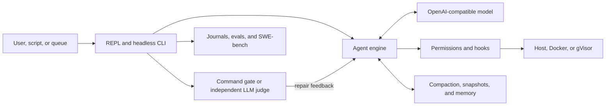

# OpenHarness

<p align="center">
  <a href="README.md"><strong>English</strong></a> ·
  <a href="README.zh-CN.md"><strong>简体中文</strong></a>
</p>

[](https://github.com/maisieyang/build-my-own-harness/actions/workflows/ci.yml)


[](https://github.com/astral-sh/ruff)


> **A local-first LLM agent harness rebuilt from scratch in Python.**
>
> It turns an OpenAI-compatible model into a coding agent with typed tool
> execution, explicit approval boundaries, resumable long-context state,
> independent completion judges, and bounded unattended repair loops.

The model supplies intelligence. OpenHarness owns the control plane around it:
what the model may do, where actions run, what survives the context window, how
work resumes, and who decides that a task is actually complete.

This is an independent learning implementation built by one developer with
coding agents. It is not a wrapper around another agent CLI, and it is not a
copy of the upstream OpenHarness implementation.

## Evidence

| Signal | Current evidence |
|---|---|
| SWE-bench Lite | **170/300 resolved (56.7%)** with qwen3.7-max, thinking off, evaluated with the self-hosted official harness |
| Test suite | **2,783 tests**, **95.29% current coverage**, enforced by a **>=95% gate** |
| Static quality | Ruff lint/format and `mypy --strict` across `src/` |
| Compatibility | CI on Python 3.10 and 3.11 |
| Design trace | Boundary decisions, capability plans, dogfood retrospectives, eval artifacts, and benchmark records are committed beside the code |

The benchmark was driven through the shipped `oh` CLI, not a private
benchmark-only agent. The complete campaign record is in
[`benchmarks/swebench/RUNLOG.md`](./benchmarks/swebench/RUNLOG.md), with the
failure analysis in
[`benchmarks/swebench/TAXONOMY.md`](./benchmarks/swebench/TAXONOMY.md) and raw
artifacts under [`benchmarks/swebench/out/`](./benchmarks/swebench/out).

## System model

At the bottom of the repository is one model-driven tool loop:

```python
while True:
    stream = llm.stream(messages)
    tool_calls = parse_tool_calls(stream)
    for call in tool_calls:
        decision = permission_checker.evaluate(call)
        result = execute(call) if decision.allowed else deny(call)
        messages.append(result)
    if stop_reason == "end_turn":
        break
```

Everything else exists because running this loop on a real repository exposes
control problems that the model cannot solve by itself.



The major ownership boundaries are:

1. **Runtime and protocol.** OpenAI-compatible streaming, Pydantic v2 wire
   types, tool-call parsing, retries, event rendering, and structured logs.
2. **Authorization and containment.** Allow/ask/deny rules, sensitive-path and
   irreversible-git red lines, lifecycle hooks, headless fail-closed behavior,
   and optional Docker/gVisor execution.
3. **Long-running state.** Tool-result truncation, reactive context recovery,
   explicit compaction, project memory, snapshots, and session resume.
4. **Capability extension.** Skills, slash commands, mode bundles, stdio MCP
   servers, native plugins, partial Claude Code plugin discovery, and
   depth-bounded `SpawnAgent` delegation.
5. **External completion.** Deterministic command gates, injection-guarded
   semantic judges, repair loops, goal decomposition, run journals, worktree
   isolation, and a persistent autopilot queue.
6. **Evaluation.** Capability-level evals, programmatic scorers, LLM-judge
   meta-evaluation, replay gates, and a subprocess-driven SWE-bench adapter.

## Three execution loops

OpenHarness exposes three distinct autonomy loops. They share the same agent
engine, but deliberately use different context and stopping semantics.

| Surface | Context | Completion gate | Intended use |
|---|---|---|---|
| `oh` / `oh chat` + `/goal` | One continuing conversation | Tool-disabled LLM judge after every reply | Interactive implementation with preserved context |
| `oh ask -p` + `--max-iter` | Fresh attempt plus structured repair feedback | Command exit code or semantic judge | Scripts, CI, and bounded headless work |
| `oh autopilot` | Persistent prioritized queue | Required command verification | Sequential unattended jobs |

These controls are intentionally separate:

- `--auto` changes permission posture by skipping confirmations. It is not a
  completion loop.
- `/goal` continues the current interactive conversation.
- `--goal-condition` judges a headless attempt semantically.
- `--verify` uses deterministic command exit codes.
- `autopilot` selects a queued card and runs the headless repair loop.

### Plan, approve, then execute

Bare `oh` opens the conversation-first REPL. The main interactive path is:

```text
>>> /plan Review the implementation and propose a verification plan

plan mode -- approve this plan?
  [1] yes, approve -- return to default mode
  [2] no, keep planning
  [3] no, discard plan mode (back to default)
plan> 1

>>> /goal Implement the approved plan; run `uv run pytest -q`; stop after 10 turns
```

`/plan` is a permission-layer clamp, not a prompt convention: `Edit`, `Write`,
and `Bash` are denied. The model has no tool that can exit plan mode. Approval
only returns the session to default mode; it does not auto-execute the plan or
grant a hidden permission preset.

`/goal <condition>` starts work immediately. After every assistant reply, the
harness gives the accumulated transcript to a separate, tool-disabled LLM call:

```text
working model turn
        |
        v
untrusted transcript --> independent judge --> pass --> persist "met" and stop
                                   |
                                   +--> fail --> append checker feedback
                                                 and continue the same session
```

Judge errors, malformed output, and invalid scores fail closed. The default
backstop is 25 consecutive auto-turns; put the real stopping condition in the
goal itself. Goals survive `oh chat --resume`.

The implementation lives in
[`src/openharness/verification/semantic_gate.py`](./src/openharness/verification/semantic_gate.py),
with the session state machine in
[`src/openharness/repl.py`](./src/openharness/repl.py) and
[`src/openharness/cli.py`](./src/openharness/cli.py).

### Headless repair loop

Use a deterministic command gate when completion has an executable oracle:

```bash
uv run oh ask -p "fix the failing tests; do not weaken assertions" \
  --output-format json \
  --verify "uv run pytest -q" \
  --max-iter 5 \
  --isolate
```

Use an independent semantic judge for criteria that cannot be reduced to an
exit code:

```bash
uv run oh ask -p "bring the release documentation up to date" \
  --output-format json \
  --goal-condition "CHANGELOG and release notes match shipped behavior" \
  --max-iter 4
```

Each failed attempt becomes structured feedback for a fresh context.
`--decompose` first splits a goal into ordered sub-goals. `--isolate` executes
inside a Git worktree. Append-only run journals support `oh run show` and
`--resume-run`.

### Autopilot queue

Autopilot is a persistent, deduplicated, priority-scored intake queue. Every
card requires at least one deterministic verification command.

```bash
uv run oh autopilot enqueue \
  --goal "fix the login regression" \
  --verify "uv run pytest -q" \
  --max-iter 3 \
  --source-ref "manual:login-regression" \
  --label bug

uv run oh autopilot list
uv run oh autopilot run-next
```

`run-next` atomically claims the highest-priority queued card and records the
repair-loop result as completed or failed.

## What the benchmark changed

The SWE-bench campaign was also a harness evaluation. Running all 300 Lite
instances surfaced five concrete control-plane defects or gaps:

- version metadata drifted from the package version;
- child processes silently resolved a different configuration source;
- the error path recommended a `--max-turns` option that did not exist;
- retry policy did not cover mid-stream transport interruption;
- provider-specific request parameters had no generic passthrough path.

The fixes were made in the production path and then reused by the adapter. A
provider changed the model's default thinking behavior during the campaign;
the response was a generic `OPENHARNESS_EXTRA_BODY` passthrough rather than a
Qwen-specific branch.

The strongest behavioral result was not the score: resolved and unresolved
completed runs had very similar turn-count distributions. A model can work for
many turns, produce a plausible patch, and still be wrong. That evidence is why
completion in OpenHarness belongs to an external oracle, never to the working
model's self-report.

## Quick start

Requires Python >=3.10, [uv](https://docs.astral.sh/uv/), and an
OpenAI-compatible Chat Completions endpoint.

```bash
curl -LsSf https://astral.sh/uv/install.sh | sh

git clone https://github.com/maisieyang/build-my-own-harness.git
cd build-my-own-harness
uv sync

cp .env.example .env
$EDITOR .env

uv run oh
```

Set `OPENHARNESS_API_KEY`, `OPENHARNESS_BASE_URL`, and
`OPENHARNESS_MODEL` in `.env`. The defaults target Qwen through DashScope, but
the loop contains no provider-specific branches.

Type `/` in the REPL to open the combined menu of built-ins, user commands, and
skills. An initial prompt can be supplied directly:

```bash
uv run oh "review this repository and identify the highest-risk gap"
```

## Command map

| Command | Purpose |
|---|---|
| `oh` / `oh chat` | Interactive multi-turn session |
| `oh ask` | One-shot or headless execution |
| `oh tools` | Inspect registered tool schemas and metadata |
| `oh config` | Show effective settings or edit the user `.env` |
| `oh hooks` | Inspect framework and plugin hooks |
| `oh memory` | Inspect the per-project memory store |
| `oh plugins` | Inspect installed native and Claude Code-format plugins |
| `oh snapshot` | List, show, and garbage-collect conversation snapshots |
| `oh eval` | Run capability-anchored prompt evals |
| `oh autopilot` | Enqueue, list, and run queued repair-loop goals |
| `oh bench swebench` | Fetch and run SWE-bench Lite cases |
| `oh run show` | Reconstruct a journal-backed headless run |

Run `uv run oh --help` or `uv run oh <command> --help` for the authoritative
option surface. All configuration uses the `OPENHARNESS_*` namespace; see
[`.env.example`](./.env.example).

## Quality contract

```bash
uv run pytest -q
uv run mypy --strict src/
uv run ruff check
uv run ruff format --check
```

- The default suite requires no live model or external service.
- Integration, Docker, gVisor, and live-model tests are explicitly gated.
- Coverage must remain at or above 95%.
- CI runs lint, format, strict typing, and tests on Python 3.10 and 3.11.
- Dogfood failures become regression tests and, when the boundary changes,
  append-only decision amendments.

## Deliberate boundaries

- The provider layer targets OpenAI-compatible Chat Completions. There is no
  native Anthropic Messages adapter.
- Claude Code plugin compatibility currently discovers plugin metadata and
  `SKILL.md` trees. Claude Code `.mcp.json` and declarative agents are not
  imported.
- MCP transport is stdio only.
- Docker/gVisor isolation is optional; host execution is the default.
- Autopilot is a local sequential queue, not a distributed scheduler or GitHub
  pull-request service.
- Semantic judges are probabilistic and therefore fail closed behind explicit
  turn/iteration caps. Prefer `--verify` whenever an executable oracle exists.

## Design record

The human owns scope, trade-offs, and acceptance criteria; coding agents drive
implementation and verification inside those contracts.

Three append-only trails preserve the reasoning around the code:

| Trail | What it records | When |
|---|---|---|
| [`decisions/`](./decisions) | Boundaries, invariants, alternatives, and anti-scope | Before implementation |
| [`tasks/`](./tasks) | Capability-level plans and acceptance checks | Before implementation |
| [`learnings/`](./learnings) | Dogfood evidence, failures, and predictions | After shipping |

Start with [`tasks/README.md`](./tasks/README.md) for the phase index,
[`learnings/openharness-first-principles.md`](./learnings/openharness-first-principles.md)
for the architectural thesis, and [`REFERENCE.md`](./REFERENCE.md) for the
frozen upstream cognition map used at the beginning of the project.

## Related work

- [finance-skills](https://github.com/maisieyang/finance-skills): vertical
  workflows that run on this harness.
- [my-skills](https://github.com/maisieyang/my-skills): reusable skills encoding
  the development method.

## Credits

The name and initial module vocabulary follow
[HKUDS/OpenHarness](https://github.com/HKUDS/OpenHarness) (MIT). This repository
is an independent, from-scratch implementation. [`REFERENCE.md`](./REFERENCE.md)
records the upstream v0.1.9 study target; it is not a copy source.

## License

MIT -- see [LICENSE](./LICENSE).
