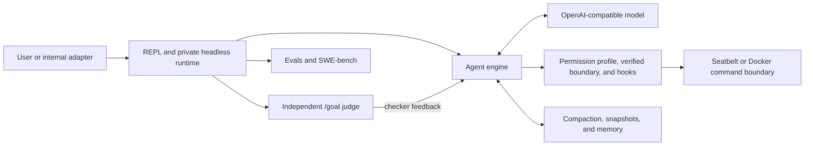

# OpenHarness

<p align="center">
  <a href="README.md"><strong>English</strong></a> ·
  <a href="README.zh-CN.md"><strong>简体中文</strong></a>
</p>

[](https://github.com/maisieyang/build-my-own-harness/actions/workflows/ci.yml)


[](https://github.com/astral-sh/ruff)


> **A local-first control plane for coding agents, built from scratch in Python.**
>
> OpenHarness turns an OpenAI-compatible model into a coding agent, then owns
> the runtime around it: tools, authorization, execution, context, extension,
> recovery, and external completion.

The model supplies intelligence. The harness manages the consequences: what the
model may do, where actions run, which evidence survives the context window,
how domain capabilities are loaded, and who decides that a task is complete.
The central claim of this project is that reliable coding agents are built as
much from these control-plane decisions as from the model itself.

## Evidence snapshot

The figures below are anchored to the CLI-stable baseline at commit
[`9b4375e`](https://github.com/maisieyang/build-my-own-harness/commit/9b4375e)
(2026-08-02), rather than presented as permanently current counters.

| Signal | Current evidence |
|---|---|
| SWE-bench Lite | **170/300 resolved (56.7%)** with qwen3.7-max, thinking off; evaluated with the official SWE-bench evaluator deployed on a self-hosted ECS |
| Test suite | **2,783 collected test items**; stable-core coverage enforced by a **>=95% gate** |
| Static quality | Ruff lint/format and `mypy --strict` across `src/` |
| Compatibility | CI on Python 3.10 and 3.11 |
| Design trace | Boundary decisions, capability plans, dogfood retrospectives, eval artifacts, and benchmark records are committed beside the code |

The benchmark was driven through the shipped `oh` CLI, not a private
benchmark-only agent. The complete campaign record is in
[`benchmarks/swebench/RUNLOG.md`](./benchmarks/swebench/RUNLOG.md), with the
failure analysis in
[`benchmarks/swebench/TAXONOMY.md`](./benchmarks/swebench/TAXONOMY.md) and raw
artifacts under [`benchmarks/swebench/out/`](./benchmarks/swebench/out).

## One-minute tour

`uv run oh` opens the conversation-first REPL from the current checkout.
Planning, approval, and execution are separate state transitions:

```text
>>> /plan Review the implementation and propose a verification plan

plan mode -- approve this plan?
  [1] yes, approve -- return to default mode
  [2] no, keep planning
  [3] no, discard plan mode (back to default)
plan> 1

>>> /goal Implement the approved plan; run `uv run pytest -m 'not integration and not eval' -q`; stop after 10 turns
```

`/plan` removes mutation and delegation capabilities from the model-visible
catalog. A deny-only dispatch guard rejects forged hidden calls. Approval returns control
to the default posture but does not auto-execute. `/goal` starts work and asks
an independent, tool-disabled judge to assess the accumulated evidence after
each assistant turn.

## System model

At the bottom of the repository is one model-driven tool loop:

```python
while True:
    stream = llm.stream(messages)
    tool_calls = parse_tool_calls(stream)
    for call in tool_calls:
        deny_if_forbidden(call)
        result = verified_dispatch(call)  # or exact approval / durable park
        messages.append(result)
    if stop_reason == "end_turn":
        break
```

Everything else exists because running this loop on a real repository exposes
control problems that the model cannot solve by itself.



The ownership model has four parts:

1. **Actions.** Typed streaming and tool calls feed a deny-only hard policy,
   lifecycle hooks, independent external-effect policy, and—when the verified
   posture is selected—one session boundary shared by local and delegated
   execution. Without a verified boundary, those domains fail closed.
2. **Evidence and state.** Tool results, compaction, memory, and snapshots
   preserve enough trustworthy state for long tasks to recover.
3. **Capabilities.** Skills, commands, mode bundles, MCP servers, plugins, and
   subagents extend the action space without adding new engine dispatch paths.
4. **Completion.** An independent semantic judge owns `/goal`'s stop decision;
   evals measure that mechanism separately from benchmark task performance.

## Context and evidence lifecycle

Long-context work is not solved by making the prompt larger. A coding agent
needs to preserve the evidence that future decisions depend on while discarding
bulk that no longer earns its token cost.

OpenHarness handles that lifecycle at several boundaries:

- tool output is truncated head-and-tail, preserving both identifying context
  and terminal summaries or errors;
- prompt-too-long errors trigger bounded reactive recovery rather than losing
  the turn;
- explicit compaction combines a structured summary with an uncompacted recent
  tail;
- project memory and per-turn checkpoints preserve durable facts separately
  from the raw transcript;
- snapshots and session resume make recovery a persisted state transition
  instead of a prompt convention.

A dogfood run exposed why this is an evidence problem: head-only Bash
truncation removed pytest's final result, leaving the model with no true count
to quote. The model fabricated one and then repeated its own fabrication on the
next turn. The production fix preserved both ends of command output and became
a regression test. See
[`learnings/dogfood-day1-tool-skill.md`](./learnings/dogfood-day1-tool-skill.md)
and [`src/openharness/tools/bash.py`](./src/openharness/tools/bash.py).

## External completion and evaluation

The working model is not allowed to declare its own work correct. `/goal` is
the single completion controller: it preserves one conversation and asks an
independent judge to decide whether another turn is needed. `--auto` selects an
exact-request reviewer; `--dry-run` independently controls whether tools execute.
Neither posture decides completion.

### Interactive control: `/plan` and `/goal`

`/plan` is capability shaping, not a prompt convention: only read-only,
non-delegated tools are sent to the model. `Edit`, `Write`, `Bash`, and `Agent`
are absent, while a deny-only policy still rejects forged or cached calls.
Approval only returns the session to default mode.

`/goal <condition>` starts work immediately. After each assistant turn, the
harness renders the accumulated transcript and sends it to a separate,
tool-disabled LLM call:

```text
working model turn
        |
        v
untrusted transcript --> independent judge --> pass --> persist "met" and stop
                                   |
                                   +--> fail --> append checker feedback
                                                 and continue the same session
```

The judge runs only after the working loop returns a clean `end_turn`; tool
failures, permission parking, truncated output, and runtime circuit breakers
remain execution concerns and never masquerade as completion. Public REPL
sessions have no loop-count cap by default. An explicit `oh --max-turns N` or
`OPENHARNESS_MAX_TURNS=N` checkpoints progress and pauses on exhaustion without
calling the judge. Goal auto-continuation is also unbounded by default; setting
`OPENHARNESS_GOAL_MAX_AUTO_TURNS=N` opts into a separate circuit breaker. Judge
errors and malformed output fail closed. Goal state is persisted with the
conversation, including terminal sentinels, so `oh --resume` does not resurrect
work that was already completed.

### Private non-interactive execution

Benchmarks and runtime tests use a private non-interactive adapter rather than
adding another public agent-starting command. The adapter runs in a child
process so each case retains an isolated cwd, environment, and wall-clock
timeout. It is an implementation boundary, not a second user-facing CLI.

### Evaluation ladder

The project separates mechanism tests from model-behavior evidence:

1. Unit and integration tests lock protocol, state-machine, and failure-path
   invariants.
2. Capability evals cover tool choice, error feedback, skill triggering,
   memory, compaction, and completion judging with programmatic scorers,
   cassette/replay, and judge meta-evaluation.
3. SWE-bench exercises the same internal runtime as the REPL across 300 real
   repository tasks and joins execution records with official verdicts for
   failure attribution.

The goal-owned completion judge lives in
[`src/openharness/services/goal_judge.py`](./src/openharness/services/goal_judge.py).
Eval datasets and their explicit pass bars live under [`evals/`](./evals).

## Capability substrate and plugin dogfood

Extensions are translated into existing runtime primitives before the model
turn starts. Skills become tool-result evidence, mode bundles compose prompts,
tool catalogs, hooks, and permission overlays, and plugins fan out into the same
stores used by first-party capabilities. The engine does not gain a separate
"plugin execution" path.

The companion
[`finance-skills`](https://github.com/maisieyang/finance-skills) repository is
the vertical proof. A Claude Code-format credit-review plugin containing four
skills was copied into the OpenHarness plugin directory without renaming files
or rewriting its schema. OpenHarness discovered the plugin, translated it into
the common manifest, namespaced its skills, and triggered them through the
existing `LoadSkill` envelope path. The envelope helper itself remained
unchanged across the plugin integration.

That dogfood also forced two honest boundaries:

- an empty-argument synthetic envelope exposed a thinking-provider protocol
  failure; the fix made the message shape provider-neutral instead of adding a
  Qwen-specific branch;
- Claude Code `.mcp.json` entries were not imported because the fixtures use
  HTTP/OAuth while OpenHarness MCP is stdio-only. Discovery reports zero MCP
  servers rather than pretending the transports are compatible.

The design and run evidence are in
[`decisions/39-phase-19-boundary.md`](./decisions/39-phase-19-boundary.md) and
[`learnings/phase-19.md`](./learnings/phase-19.md).

## What the benchmark changed

The SWE-bench campaign was also a harness evaluation. Running all 300 Lite
instances surfaced five concrete control-plane defects or gaps:

- version metadata drifted from the package version;
- child processes silently resolved a different configuration source;
- the error path recommended a `--max-turns` option that did not exist;
- retry policy did not cover mid-stream transport interruption;
- provider-specific request parameters had no generic passthrough path.

The fixes were made in the production path and then reused by the adapter. A
provider changed the model's default thinking behavior during the campaign;
the response was a generic `OPENHARNESS_EXTRA_BODY` passthrough rather than a
Qwen-specific branch.

The strongest behavioral result was not the score: resolved and unresolved
completed runs had very similar turn-count distributions. A model can work for
many turns, produce a plausible patch, and still be wrong. That evidence is why
completion in OpenHarness belongs to an external oracle, never to the working
model's self-report.

## Quick start

OpenHarness is currently developed and dogfooded from source. It requires
Python >=3.10, [uv](https://docs.astral.sh/uv/), and an OpenAI-compatible Chat
Completions endpoint.

```bash
# Install uv if it is not already available.
curl -LsSf https://astral.sh/uv/install.sh | sh

# Clone OpenHarness and install its dependencies.
git clone https://github.com/maisieyang/build-my-own-harness.git
cd build-my-own-harness
uv sync

# Create the local configuration.
cp .env.example .env
$EDITOR .env
```

In `.env`, set the model provider API key and compatible base URL, then choose
a model served by that endpoint. The Web capability API key is optional; leave
it blank to start without Web tools. Keep `.env` local and never commit
credentials.

Start the Agent from this checkout:

```bash
# Use the configured interactive posture.
uv run oh

# Explicitly use the automated exact-request reviewer and verified sandbox.
uv run oh --auto --sandbox
```

Use the first command for ordinary interactive work. Use the second for
unattended dogfood where exact permission requests should be reviewed
automatically while local execution remains inside the verified sandbox. The
flags affect only that invocation; they do not change `.env` defaults.

When the `>>>` prompt appears, enter a task to begin. Type `/` to open the
current session's command menu.

### Why always use `uv run oh`?

Always launch OpenHarness through the current checkout, including from a Git
worktree:

```bash
uv run oh
```

`uv run` resolves the `pyproject.toml`, environment, and source code belonging
to the current checkout. In a worktree, the running harness therefore follows
that worktree's branch and includes its uncommitted changes. A bare `oh` is
resolved from `PATH` and may execute code from another checkout, so it is not a
supported launcher for this source-only workflow.

### macOS Seatbelt dogfood

The minimum `.env.example` block already enables the sandbox. The default
backend on macOS is Seatbelt, and the root Agent entry starts the interactive
chat session, so the everyday dogfood command is simply:

```bash
uv run oh
```

Run it from a normal macOS Terminal, not from an `oh` or other process that is
already running under Seatbelt: macOS does not allow nested `sandbox-exec`
boundaries. Inside the REPL, use `/permissions` to confirm that the installed
boundary reports `macos-seatbelt sandbox-exec (verified)`.

### Permission model

`permission_profile` is the single configured authorization intent for local
filesystem, network, environment, process, and external-tool surfaces. The
sandbox backend translates that intent into an installed boundary and reports
verifiable facts; configuration alone is never treated as proof of enforcement.
`--auto` chooses the reviewer for exact deltas, while `--dry-run` independently
chooses whether calls execute. They can be combined.

Legacy `permission_mode`, `permissions.allow/deny/ask`, `deny_paths`, and
sandbox-owned network/external policy fields are rejected at startup with a
canonical replacement. Unrepresentable rules must be rewritten explicitly;
the migration path never widens authority.

### Project instructions

OpenHarness owns the loading mechanism; the project where `oh` is started owns
the instructions. At session startup, the harness reads `AGENTS.md`,
`CLAUDE.md`, `.claude/CLAUDE.md`, and sorted `.claude/rules/*.md` files inside
that workspace and injects them under `## Project Instructions`. It never reads
instruction files from the OpenHarness installation directory, filesystem
ancestors, or a user-global fallback. Project instructions remain enabled when
durable memory is disabled.

## Using OpenHarness

### How do I get started?

OpenHarness has one public Agent entry: `oh [OPTIONS]`. From this repository or
one of its worktrees, always invoke it with `uv run oh`.

```bash
uv run oh
```

### What can I do? — Shell CLI

```text
oh [OPTIONS]              # the Agent entry
├── config                # user configuration; `oh config` shows effective settings
│   └── edit
├── inspect               # read-only runtime inspection
│   ├── tools
│   ├── hooks
│   └── plugins
├── state                 # persistent state for the current project
│   ├── memory
│   └── snapshots
└── dev                   # contributor workflows
    ├── eval
    └── bench
```

Common ways to start the Agent while developing this repository:

```bash
# Temporarily choose a model.
uv run oh --model qwen3.7-max

# Use the automated reviewer for exact permission requests.
uv run oh --auto

# Preview tool calls without executing them.
uv run oh --dry-run

# Explicitly use macOS Seatbelt.
uv run oh --sandbox --sandbox-backend seatbelt

# Resume the latest session for this project.
uv run oh --resume

# Combine session options.
uv run oh --model qwen3.7-max --auto --sandbox
```

### How do I run evals? — Manual only

Dataset evals never run in CI or in the default test suite. Every invocation
must name `live`, `record`, or `replay` explicitly; a bare command fails closed.

```bash
# Discover the capability evals.
uv run oh dev eval --help

# Replay a committed cassette without an API call.
uv run oh dev eval error_feedback --mode replay

# Run one live diagnostic case.
uv run oh dev eval error_feedback --mode live \
  --case A6-grep-launch-denied
```

See the [evaluation handbook](./evals/README.md) for validation levels, mode
semantics, model selection, recording policy, the capability catalog, and
troubleshooting.

### How do I control a session? — REPL slash commands

The REPL has three work flows: work normally, explore safely, and work toward a
verifiable completion condition.

#### Default — work normally

Enter a task directly. The Agent works with the current tool and permission
configuration.

#### Plan — explore safely before acting

`/plan [prompt]` enters read-only exploration: edits and shell commands are
blocked. After every completed reply, a plan menu lets you keep planning,
approve the plan and return to Default, or discard it. If a permission request
parks the turn, resolve it and use `/resume` before the approval menu appears.

#### Goal — keep working until a condition is met

`/goal <condition>` sets a verifiable completion condition and starts work
immediately. While in Default, an independent checker evaluates each turn and
continues the session until the condition is met. Use `/goal` to view status or
`/goal clear` to stop the controller. A goal can be set while planning, but
the checker runs only after the session returns to Default.

Goal auto-continuation has no default count limit. To add an explicit circuit
breaker for local dogfood, set it in `.env`:

```env
OPENHARNESS_GOAL_MAX_AUTO_TURNS=100
```

This pauses the Goal after 100 automatically continued session turns; it does
not limit the tool calls inside an Agent Loop.

#### Maintain the conversation

`/compact` compresses earlier conversation context while preserving the recent
exchange. `/clear` clears the conversation and any active goal.

#### Handle permission decisions

`/permissions` shows configured intent and the verified runtime boundary. When
an exact request needs a person, the REPL immediately shows a no-default menu:

```text
[1] Approve once and continue
[2] Deny and continue
```

Either choice continues the interrupted Agent Loop directly; it does not need
`/resume` and does not ask the model to reconstruct the Tool Call. Pressing
Ctrl+C postpones the decision without discarding it; `/approve [id]` and
`/deny [id]` remain available for that recovery path. `/resume` is reserved for
an externally recorded decision whose saved continuation has not been consumed.

#### Inspect and extend context

`/memory` lists memories for the current project and `/skills` lists available
skills. User-authored commands are Markdown files in `~/.openharness/commands/`
or `<project>/.openharness/commands/`; project entries override global ones and
are invoked as `/<name> [args]`. If no built-in or user command matches,
`/<skill-name>` falls through to a discovered skill. The resolution order is
built-in command, user command, then skill.

#### Discover and exit

`/` opens the current session's scrollable command menu; use arrow keys to
browse it or keep typing to filter it. `/help` prints the stable built-in
reference. Use `/exit` to leave the REPL (`/quit` is an alias).

All configuration uses the `OPENHARNESS_*` namespace; see
[`.env.example`](./.env.example).

## Quality contract

```bash
uv run pytest -m "not integration and not eval" -q
uv run mypy --strict src/
uv run ruff check
uv run ruff format --check
```

- The CI/default gate excludes integration tests and all dataset eval gates.
- `uv run pytest -m eval -q --no-cov` runs committed cassette replay gates manually;
  it makes no model call.
- `uv run pytest -m integration` runs explicitly gated real-process or
  live-service checks and may require Node, Docker, gVisor, credentials, or
  network access depending on the selected test.
- Coverage must remain at or above 95%.
- CI runs lint, format, strict typing, and tests on Python 3.10 and 3.11.
- Dogfood failures become regression tests and, when the boundary changes,
  append-only decision amendments.

## Deliberate boundaries

- The provider layer targets OpenAI-compatible Chat Completions. There is no
  native Anthropic Messages adapter.
- Claude Code plugin compatibility currently discovers plugin metadata and
  `SKILL.md` trees. Claude Code `.mcp.json` and declarative agents are not
  imported.
- MCP transport is stdio only. Its subprocess always receives a minimal,
  credential-filtered environment. An unsandboxed stdio server must be on the
  explicit trusted-server list; otherwise startup fails closed.
- MCP, Web, Browser, and Computer Use are independent external-effect policy
  surfaces. A local filesystem sandbox never implies that these calls are safe;
  untrusted, unknown, mutating, and destructive external calls still require
  exact approval even under a broad surface allow.
- Hooks and plugins are opt-in trusted, in-process control-plane code. They can
  enforce or rewrite a call, but rewritten final arguments are authorized again
  before dispatch.
- Isolation remains opt-in at startup. On macOS the Seatbelt backend covers the unified
  local data plane with a deny-by-default policy, same-sandbox-only process
  signals, explicit workspace/profile roots, and reported toolchain read
  dependencies. Docker remains an explicitly command-only backend; existing
  protected control paths are read-only binds and missing ones are reserved by
  read-only mounts so the reported boundary cannot be created around later. A
  non-sandbox posture cannot execute local or delegated tools. Autonomous execution
  (`--auto`, an active Goal, or the private non-interactive adapter) fails before the first model call
  if any exposed local/delegated capability lacks verified boundary coverage;
  a no-sandbox read-only catalog is not exempt. Dry-run and pure external/control
  catalogs do not require a local boundary.
- Domain-restricted network access is mediated by the managed proxy. Plain HTTP
  binds the `Host` header to the checked absolute URL; public HTTPS CONNECT
  binds cleartext TLS SNI to the checked authority and fails closed when that
  identity cannot be verified. Private and loopback targets remain independent
  explicit profile choices.
- The `/goal` judge is probabilistic, reads conversation evidence rather than
  operating-system state, and fails closed. Goal may be given an independent
  auto-continue circuit breaker explicitly; it is disabled by default and is
  not an Agent Loop turn cap.
- Permission intent and enforcement evidence are separate contracts. Every
  exact request carries one closed evidence variant: local requests bind the
  active profile, verified boundary, backend, and final operation; external
  requests bind the active profile, policy surface, effect/trust facts, and
  tool/server identity without claiming a local sandbox. Reviewers also receive
  the original human authorization context, exact final arguments, data flow,
  and minimal delta. Local grants install one exact overlay only after the
  replacement boundary proves the same backend and covers the requested
  effect; external exact grants can be reviewed, parked, and resumed without a
  local boundary and remain one-shot. Hard denies never reach review. Requests
  a reviewer cannot resolve are durably parked before `/approve` or `/deny`;
  `/goal` pauses before its judge and resumes only after an explicit decision
  plus `/resume`.

## Design record

The human owns scope, trade-offs, and acceptance criteria; coding agents drive
implementation and verification inside those contracts.

Three append-only trails preserve the reasoning around the code:

| Trail | What it records | When |
|---|---|---|
| [`decisions/`](./decisions) | Boundaries, invariants, alternatives, and anti-scope | Before implementation |
| [`tasks/`](./tasks) | Capability-level plans and acceptance checks | Before implementation |
| [`learnings/`](./learnings) | Dogfood evidence, failures, and predictions | After shipping |

Start with [`tasks/README.md`](./tasks/README.md) for the phase index,
[`learnings/openharness-first-principles.md`](./learnings/openharness-first-principles.md)
for the architectural thesis, and [`REFERENCE.md`](./REFERENCE.md) for the
frozen upstream cognition map used at the beginning of the project.

## Related work

- [finance-skills](https://github.com/maisieyang/finance-skills): vertical
  workflows that run on this harness.
- [my-skills](https://github.com/maisieyang/my-skills): reusable skills encoding
  the development method.

## Credits

The name and initial module vocabulary follow
[HKUDS/OpenHarness](https://github.com/HKUDS/OpenHarness) (MIT). This repository
is an independent, from-scratch implementation. [`REFERENCE.md`](./REFERENCE.md)
records the upstream v0.1.9 study target; it is not a copy source.

## License

MIT -- see [LICENSE](./LICENSE).
