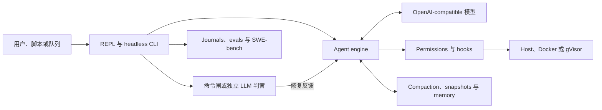

# OpenHarness

<p align="center">
  <a href="README.md"><strong>English</strong></a> ·
  <a href="README.zh-CN.md"><strong>简体中文</strong></a>
</p>

[](https://github.com/maisieyang/build-my-own-harness/actions/workflows/ci.yml)


[](https://github.com/astral-sh/ruff)


> **一个用 Python 从零重建、local-first 的 LLM agent harness。**
>
> 它把 OpenAI-compatible 模型变成 coding agent，并补上类型化工具执行、明确的
> 审批边界、可恢复的长上下文状态、独立完成判官，以及有上限的无人值守修复循环。

模型提供智能；OpenHarness 拥有模型周围的控制面：允许做什么、动作在哪里执行、
哪些状态能跨过 context window、工作如何恢复，以及谁有权判断任务真的完成。

这是一个由一名开发者与 coding agents 共同建造的独立学习实现。它不包装其他
agent CLI，也不是对上游 OpenHarness 实现的复制。

## 证据

| 信号 | 当前证据 |
|---|---|
| SWE-bench Lite | qwen3.7-max、关闭 thinking，使用自建官方 harness 评测，**170/300 resolved（56.7%）** |
| 测试套件 | **2,783 项测试**，当前覆盖率 **95.29%**，门禁 **>=95%** |
| 静态质量 | 全量 `src/` 通过 Ruff lint/format 与 `mypy --strict` |
| 兼容性 | CI 覆盖 Python 3.10 和 3.11 |
| 设计留痕 | Boundary decisions、capability plans、dogfood 复盘、eval artifacts 与 benchmark records 全部和代码一起提交 |

Benchmark 直接驱动公开的 `oh` CLI，不使用私有的 benchmark-only agent。完整
战役记录见 [`benchmarks/swebench/RUNLOG.md`](./benchmarks/swebench/RUNLOG.md)，
失败分类见
[`benchmarks/swebench/TAXONOMY.md`](./benchmarks/swebench/TAXONOMY.md)，原始
artifact 在 [`benchmarks/swebench/out/`](./benchmarks/swebench/out)。

## 系统模型

仓库最底下只有一个模型驱动的工具循环：

```python
while True:
    stream = llm.stream(messages)
    tool_calls = parse_tool_calls(stream)
    for call in tool_calls:
        decision = permission_checker.evaluate(call)
        result = execute(call) if decision.allowed else deny(call)
        messages.append(result)
    if stop_reason == "end_turn":
        break
```

其余系统之所以存在，是因为把这个循环真正放进代码仓库后，会暴露一批模型无法
自己解决的控制问题。



OpenHarness 负责的主要边界是：

1. **Runtime 与 protocol。** OpenAI-compatible streaming、Pydantic v2 wire
   types、tool-call parsing、retry、事件渲染和结构化日志。
2. **授权与隔离。** allow/ask/deny 规则、敏感路径与不可逆 Git 红线、生命周期
   hooks、headless fail-closed，以及可选 Docker/gVisor 执行。
3. **长任务状态。** Tool-result 截断、反应式 context 恢复、显式 compaction、
   项目 memory、snapshots 和 session resume。
4. **能力扩展。** Skills、slash commands、mode bundles、stdio MCP、原生
   plugins、部分 Claude Code plugin discovery，以及有深度上限的 `SpawnAgent`
   委派。
5. **外部完成判定。** 确定性命令闸、防注入语义判官、repair loops、goal
   decomposition、run journals、worktree isolation 和持久化 autopilot queue。
6. **Evaluation。** Capability-level eval、programmatic scorer、LLM judge
   meta-evaluation、replay gates，以及 subprocess 驱动的 SWE-bench adapter。

## 三种执行循环

OpenHarness 暴露三种不同的自治循环。它们共用同一个 agent engine，但刻意采用
不同的 context 和停止语义。

| 入口 | Context | 完成闸 | 适用场景 |
|---|---|---|---|
| `oh` / `oh chat` + `/goal` | 一段持续对话 | 每次回复后交给禁用工具的 LLM 判官 | 保留上下文的交互式实现 |
| `oh ask -p` + `--max-iter` | fresh attempt + 结构化 repair feedback | 命令退出码或语义判官 | 脚本、CI 和有界 headless 任务 |
| `oh autopilot` | 持久化优先级队列 | 必填的命令验证 | 顺序执行的无人值守任务 |

这些控制项职责不同：

- `--auto` 只改变权限姿态，跳过 confirmation；它不是完成循环。
- `/goal` 在当前交互式 conversation 中续跑。
- `--goal-condition` 对 headless attempt 做语义判定。
- `--verify` 使用确定性的命令退出码。
- `autopilot` 选取队列 card，再运行 headless repair loop。

### Plan、审批、再执行

裸 `oh` 直接进入 conversation-first REPL。主要交互路径是：

```text
>>> /plan 检查当前实现，并给出一份验证计划

plan mode -- approve this plan?
  [1] yes, approve -- return to default mode
  [2] no, keep planning
  [3] no, discard plan mode (back to default)
plan> 1

>>> /goal 执行刚批准的计划；运行 `uv run pytest -q`；最多 10 turns 后停止
```

`/plan` 是权限层钳制，不是 prompt 约定：`Edit`、`Write` 与 `Bash` 都被
deny。模型没有退出 plan mode 的工具。批准只让 session 回到 default mode；
不会自动执行计划，也不会暗中授予新的 permission preset。

`/goal <condition>` 会立即开工。每次 assistant 回复后，harness 会把累计
transcript 交给一次独立、禁用工具的 LLM 调用：

```text
工作模型的一轮
      |
      v
不可信 transcript --> 独立判官 --> pass --> 持久化 "met" 并停止
                                |
                                +--> fail --> 追加 checker feedback
                                              并在同一 session 继续
```

Judge 异常、无法解析的输出和非法 score 一律 fail closed。默认兜底是连续 25 个
auto-turn；真正的停止条件应该写进 goal。活跃 goal 可通过 `oh chat --resume`
恢复。

实现入口是
[`src/openharness/verification/semantic_gate.py`](./src/openharness/verification/semantic_gate.py)，
session 状态机位于
[`src/openharness/repl.py`](./src/openharness/repl.py) 与
[`src/openharness/cli.py`](./src/openharness/cli.py)。

### Headless repair loop

当完成条件有可执行 oracle 时，使用确定性命令闸：

```bash
uv run oh ask -p "修复失败测试；不要弱化断言" \
  --output-format json \
  --verify "uv run pytest -q" \
  --max-iter 5 \
  --isolate
```

当条件无法收敛为 exit code 时，使用独立语义判官：

```bash
uv run oh ask -p "把发布文档更新到当前状态" \
  --output-format json \
  --goal-condition "CHANGELOG 和 release notes 与已发布行为一致" \
  --max-iter 4
```

每次失败都会变成结构化反馈，进入一个 fresh context。`--decompose` 先把 goal
拆成有序 sub-goals；`--isolate` 在 Git worktree 内执行；append-only run
journal 支持 `oh run show` 与 `--resume-run`。

### Autopilot 队列

Autopilot 是持久化、去重、按优先级评分的 intake queue。每张 card 至少需要一条
确定性验证命令。

```bash
uv run oh autopilot enqueue \
  --goal "修复登录回归" \
  --verify "uv run pytest -q" \
  --max-iter 3 \
  --source-ref "manual:login-regression" \
  --label bug

uv run oh autopilot list
uv run oh autopilot run-next
```

`run-next` 原子领取优先级最高的 queued card，并把 repair-loop 结果记录为
completed 或 failed。

## Benchmark 改变了什么

SWE-bench 战役也是一次 harness eval。完整运行 300 个 Lite instance，暴露了
五个具体的控制面缺陷或缺口：

- 版本 metadata 与 package version 漂移；
- child process 静默读取了不同的配置源；
- 错误消息建议使用一个当时并不存在的 `--max-turns`；
- retry policy 没有覆盖 mid-stream transport interruption；
- provider-specific request 参数没有通用透传路径。

这些修复都进入 production path，再由 adapter 复用。战役中 provider 改变了
模型默认 thinking 行为；最终修复是通用 `OPENHARNESS_EXTRA_BODY` 透传，而不是
新增 Qwen-specific 分支。

最重要的行为结论不是分数：resolved 与 unresolved-completed runs 的 turn 数分布
非常接近。模型可以工作很多轮、产出看似合理的 patch，最后仍然错误。这条证据
直接支撑 OpenHarness 的完成边界：完成必须交给外部 oracle，而不是工作模型的
self-report。

## 快速开始

需要 Python >=3.10、[uv](https://docs.astral.sh/uv/)，以及 OpenAI-compatible
Chat Completions endpoint。

```bash
curl -LsSf https://astral.sh/uv/install.sh | sh

git clone https://github.com/maisieyang/build-my-own-harness.git
cd build-my-own-harness
uv sync

cp .env.example .env
$EDITOR .env

uv run oh
```

在 `.env` 中填写 `OPENHARNESS_API_KEY`、`OPENHARNESS_BASE_URL` 和
`OPENHARNESS_MODEL`。默认配置通过 DashScope 使用 Qwen，但 agent loop 内没有
provider-specific 分支。

在 REPL 中输入 `/`，会打开 built-ins、用户 commands 与 skills 共用的菜单。
也可以直接带一个初始 prompt：

```bash
uv run oh "检查当前仓库，指出风险最高的缺口"
```

## 命令地图

| 命令 | 作用 |
|---|---|
| `oh` / `oh chat` | 交互式多轮 session |
| `oh ask` | 单次提问或 headless 执行 |
| `oh tools` | 查看注册工具的 schema 和 metadata |
| `oh config` | 查看生效配置或编辑用户 `.env` |
| `oh hooks` | 查看 framework 与 plugin hooks |
| `oh memory` | 查看按项目存储的 memory |
| `oh plugins` | 查看已安装的原生与 Claude Code-format plugins |
| `oh snapshot` | 列出、查看和清理 conversation snapshots |
| `oh eval` | 运行 capability-anchored prompt eval |
| `oh autopilot` | 入队、列出和执行 repair-loop goals |
| `oh bench swebench` | 获取并运行 SWE-bench Lite cases |
| `oh run show` | 重建 journal-backed headless run |

以 `uv run oh --help` 和 `uv run oh <command> --help` 为 option surface 的
权威来源。所有配置都使用 `OPENHARNESS_*` namespace，见
[`.env.example`](./.env.example)。

## 质量契约

```bash
uv run pytest -q
uv run mypy --strict src/
uv run ruff check
uv run ruff format --check
```

- 默认测试不需要 live model 或外部服务。
- Integration、Docker、gVisor 与 live-model tests 都显式把关。
- Coverage 必须保持在 95% 以上。
- CI 在 Python 3.10 和 3.11 上运行 lint、format、strict typing 与 tests。
- Dogfood failure 会变成 regression test；边界发生变化时，还会追加
  append-only decision amendment。

## 刻意保留的边界

- Provider 层只面向 OpenAI-compatible Chat Completions；没有原生 Anthropic
  Messages adapter。
- Claude Code plugin compatibility 当前只发现 plugin metadata 与 `SKILL.md`
  tree，不导入 Claude Code `.mcp.json` 和 declarative agents。
- MCP transport 仅支持 stdio。
- Docker/gVisor isolation 是可选项；默认仍是 host execution。
- Autopilot 是本地顺序队列，不是 distributed scheduler 或 GitHub PR service。
- Semantic judge 具有概率性，因此必须 fail closed，并受明确的 turn/iteration
  cap 约束。只要存在可执行 oracle，就应优先使用 `--verify`。

## 设计留痕

人负责 scope、trade-off 与 acceptance criteria；coding agents 在这些 contract
内驱动实现与验证。

三条 append-only trail 保存代码周围的推理过程：

| Trail | 记录什么 | 何时写 |
|---|---|---|
| [`decisions/`](./decisions) | 边界、不变量、备选方案和 anti-scope | 实现之前 |
| [`tasks/`](./tasks) | Capability-level plans 与验收检查 | 实现之前 |
| [`learnings/`](./learnings) | Dogfood 证据、失败和预测 | 发布之后 |

入口分别是 [`tasks/README.md`](./tasks/README.md) 的 phase index、
[`learnings/openharness-first-principles.md`](./learnings/openharness-first-principles.md)
的架构主张，以及项目初期使用的上游冻结认知地图
[`REFERENCE.md`](./REFERENCE.md)。

## 相关项目

- [finance-skills](https://github.com/maisieyang/finance-skills)：运行在本
  harness 上的垂直工作流。
- [my-skills](https://github.com/maisieyang/my-skills)：把开发方法编码成可复用
  skills。

## 致谢

名称与最初的模块词汇来自
[HKUDS/OpenHarness](https://github.com/HKUDS/OpenHarness)（MIT）。本仓库是
独立、从零的实现。[`REFERENCE.md`](./REFERENCE.md) 记录上游 v0.1.9 研究
标的，不是复制源。

## License

MIT -- 见 [LICENSE](./LICENSE)。
