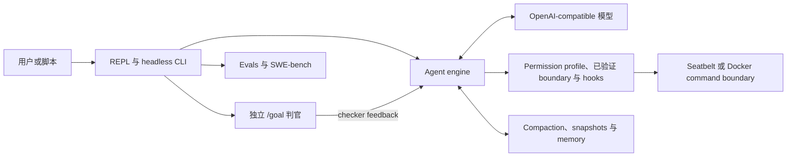

# OpenHarness

<p align="center">
  <a href="README.md"><strong>English</strong></a> ·
  <a href="README.zh-CN.md"><strong>简体中文</strong></a>
</p>

[](https://github.com/maisieyang/build-my-own-harness/actions/workflows/ci.yml)


[](https://github.com/astral-sh/ruff)


> **一个用 Python 从零构建、local-first 的 Coding Agent 控制面。**
>
> OpenHarness 把 OpenAI-compatible 模型变成 coding agent，并负责它周围的
> runtime：工具、授权、执行、上下文、扩展、恢复与外部完成判定。

模型提供智能；harness 管理动作的后果：模型允许做什么、动作在哪里执行、哪些
证据能跨过 context window、领域能力如何加载，以及谁有权判断任务真的完成。
本项目的核心主张是：可靠的 Coding Agent 不只取决于模型，也同样取决于这些
控制面决策。

## 证据快照

以下数字锚定在 2026-08-02 的 CLI 稳定基线 commit
[`9b4375e`](https://github.com/maisieyang/build-my-own-harness/commit/9b4375e)，
而不是把会持续变化的计数写成永久“当前值”。

| 信号 | 当前证据 |
|---|---|
| SWE-bench Lite | qwen3.7-max、关闭 thinking，使用部署在自建 ECS 上的 SWE-bench 官方 evaluator，**170/300 resolved（56.7%）** |
| 测试套件 | **2,783 个 collected test items**；stable-core coverage 门禁 **>=95%** |
| 静态质量 | 全量 `src/` 通过 Ruff lint/format 与 `mypy --strict` |
| 兼容性 | CI 覆盖 Python 3.10 和 3.11 |
| 设计留痕 | Boundary decisions、capability plans、dogfood 复盘、eval artifacts 与 benchmark records 全部和代码一起提交 |

Benchmark 直接驱动公开的 `oh` CLI，不使用私有的 benchmark-only agent。完整
战役记录见 [`benchmarks/swebench/RUNLOG.md`](./benchmarks/swebench/RUNLOG.md)，
失败分类见
[`benchmarks/swebench/TAXONOMY.md`](./benchmarks/swebench/TAXONOMY.md)，原始
artifact 在 [`benchmarks/swebench/out/`](./benchmarks/swebench/out)。

## 一分钟体验

`uv run oh` 从当前 checkout 进入 conversation-first REPL。规划、审批和执行是
三个独立的状态转换：

```text
>>> /plan 检查当前实现，并给出一份验证计划

plan mode -- approve this plan?
  [1] yes, approve -- return to default mode
  [2] no, keep planning
  [3] no, discard plan mode (back to default)
plan> 1

>>> /goal 执行刚批准的计划；运行 `uv run pytest -m 'not integration and not eval' -q`；最多 10 turns 后停止
```

`/plan` 从模型可见 catalog 中移除修改与委派能力，并用 deny-only dispatch guard
拒绝伪造的隐藏调用；批准只返回 default posture，不自动执行。
`/goal` 会立即开工，并在每个 assistant turn 后交给一个独立、禁用工具的判官，
依据累积证据判断是否完成。

## 系统模型

仓库最底下只有一个模型驱动的工具循环：

```python
while True:
    stream = llm.stream(messages)
    tool_calls = parse_tool_calls(stream)
    for call in tool_calls:
        deny_if_forbidden(call)
        result = verified_dispatch(call)  # 或 exact approval / durable park
        messages.append(result)
    if stop_reason == "end_turn":
        break
```

其余系统之所以存在，是因为把这个循环真正放进代码仓库后，会暴露一批模型无法
自己解决的控制问题。



控制面的 ownership model 分为四部分：

1. **动作。** Typed streaming 和 tool call 进入 deny-only hard policy、生命周期
   hooks 与独立 external-effect policy；选择 verified posture 后，本地与 delegated
   execution 共享同一个已验证的 session boundary；没有 verified boundary 时，这两个
   domain 会 fail closed。
2. **证据与状态。** Tool results、compaction、memory 与 snapshots 保存长任务
   恢复所需的可信状态。
3. **能力。** Skills、commands、mode bundles、MCP、plugins 与 subagents 扩展
   action space，而不为 engine 增加新的 dispatch 路径。
4. **完成。** 独立语义判官拥有 `/goal` 的停止权；eval 把这项机制的质量与
   benchmark 任务表现分开测量。

## Context 与证据生命周期

长上下文问题不能只靠扩大 prompt 解决。Coding Agent 必须保住未来决策依赖的证据，
同时丢弃已经不值得继续占用 token 的体量。

OpenHarness 在多个边界管理这条生命周期：

- tool output 采用 head-and-tail 截断，同时保住身份上下文和结尾的汇总或错误；
- prompt-too-long 触发有上限的反应式恢复，而不是丢失当前 turn；
- 显式 compaction 把结构化摘要与未经压缩的最近消息尾部拼接；
- project memory 与逐 turn checkpoint 把持久事实从原始 transcript 中分离；
- snapshots 与 session resume 把恢复做成持久化状态转换，而不是 prompt 约定。

一次 dogfood 直接说明了为什么这是“证据问题”：Bash 原先只保留输出头部，截掉了
pytest 最后一行结果；模型因此没有真数字可引用，编造了一个数字，并在下一轮继续
引用自己的编造。生产修复改为保留输出两端并加入回归测试。证据见
[`learnings/dogfood-day1-tool-skill.md`](./learnings/dogfood-day1-tool-skill.md)
和 [`src/openharness/tools/bash.py`](./src/openharness/tools/bash.py)。

## 外部完成判定与 Evaluation

工作模型无权宣布自己的工作正确。`/goal` 是唯一的 completion controller：它
保留同一段 conversation，并由独立判官决定是否需要继续下一 turn。`--auto`
只选择 exact-request reviewer，`--dry-run` 独立决定工具是否实际执行；两者都不负责判断完成。

### 交互控制：`/plan` 与 `/goal`

`/plan` 是 capability shaping，不是 prompt 约定：模型只收到 read-only、
non-delegated tools；`Edit`、`Write`、`Bash` 与 `Agent` 不出现在 catalog 中，
deny-only policy 仍会拒绝伪造或缓存的调用。审批只让 session 回到 default mode。

`/goal <condition>` 会立即开工。每个 assistant turn 之后，harness 会渲染累积
transcript，并交给一次独立、禁用工具的 LLM 调用：

```text
工作模型的一轮
      |
      v
不可信 transcript --> 独立判官 --> pass --> 持久化 "met" 并停止
                                |
                                +--> fail --> 追加 checker feedback
                                              并在同一 session 继续
```

Judge 异常和无法解析的输出一律 fail closed；hard turn cap 为 false negative 与
provider failure 提供上界。Goal 状态与 conversation 一起持久化，包含终态哨兵，
因此 `oh --resume` 不会复活已经完成的工作。

### 私有非交互执行

Benchmark 与 runtime tests 使用私有非交互 adapter，不再增加第二个公开的 Agent
启动命令。Adapter 在子进程中运行，因此每个 case 都有独立的 cwd、environment 与
wall-clock timeout。这是一条内部实现边界，不是第二套面向用户的 CLI。

### Evaluation 阶梯

项目把机制测试与模型行为证据分开：

1. Unit 和 integration tests 锁定 protocol、状态机与失败路径不变量。
2. Capability evals 覆盖 tool choice、error feedback、skill trigger、memory、
   compaction 与 completion judge，并使用 programmatic scorer、cassette/replay
   与 judge meta-evaluation。
3. SWE-bench 通过与 REPL 相同的内部 runtime 驱动 300 个真实仓库任务，再把
   execution records 与
   官方 verdict join，进行 failure attribution。

`/goal` 专属 completion judge 位于
[`src/openharness/services/goal_judge.py`](./src/openharness/services/goal_judge.py)；
eval datasets 与明确 pass bar 位于 [`evals/`](./evals)。

## 能力基座与 Plugin Dogfood

扩展能力会在 model turn 开始前被翻译成已有 runtime primitives。Skill body 作为
tool-result 证据进入上下文；mode bundle 组合 prompt、tool catalog、hooks 与
permission overlay；plugin 则 fan out 到 first-party capability 使用的同一组 store。
Engine 不存在单独的“plugin execution”路径。

配套仓库 [`finance-skills`](https://github.com/maisieyang/finance-skills) 是这条
垂直化路径的实证。一个包含 4 个 skills 的 Claude Code-format 信审 plugin，未经
文件改名或 schema 改写，直接复制进 OpenHarness plugin 目录。OpenHarness 完成
discovery、统一 manifest 翻译、skill namespacing，并通过既有 `LoadSkill`
envelope 路径触发；envelope helper 在接入 plugin 的过程中保持零修改。

Dogfood 也逼出了两条诚实边界：

- empty-args synthetic envelope 触发 thinking provider 的协议错误；最终修复选择
  provider-neutral message shape，而不是增加 Qwen-specific branch；
- finance-skills 的 Claude Code `.mcp.json` 使用 HTTP/OAuth，而 OpenHarness MCP
  仅支持 stdio，因此不导入这些配置；discovery 明确报告零 MCP server，不假装
  transport 兼容。

设计与运行证据见
[`decisions/39-phase-19-boundary.md`](./decisions/39-phase-19-boundary.md) 和
[`learnings/phase-19.md`](./learnings/phase-19.md)。

## Benchmark 改变了什么

SWE-bench 战役也是一次 harness eval。完整运行 300 个 Lite instance，暴露了
五个具体的控制面缺陷或缺口：

- 版本 metadata 与 package version 漂移；
- child process 静默读取了不同的配置源；
- 错误消息建议使用一个当时并不存在的 `--max-turns`；
- retry policy 没有覆盖 mid-stream transport interruption；
- provider-specific request 参数没有通用透传路径。

这些修复都进入 production path，再由 adapter 复用。战役中 provider 改变了
模型默认 thinking 行为；最终修复是通用 `OPENHARNESS_EXTRA_BODY` 透传，而不是
新增 Qwen-specific 分支。

最重要的行为结论不是分数：resolved 与 unresolved-completed runs 的 turn 数分布
非常接近。模型可以工作很多轮、产出看似合理的 patch，最后仍然错误。这条证据
直接支撑 OpenHarness 的完成边界：完成必须交给外部 oracle，而不是工作模型的
self-report。

## 快速开始

OpenHarness 当前只维护从源码开发和 dogfood 的使用路径。需要 Python >=3.10、
[uv](https://docs.astral.sh/uv/)，以及 OpenAI-compatible Chat Completions
endpoint。

```bash
# 如果尚未安装 uv，先安装 uv
curl -LsSf https://astral.sh/uv/install.sh | sh

# 克隆 OpenHarness 并安装依赖
git clone https://github.com/maisieyang/build-my-own-harness.git
cd build-my-own-harness
uv sync

# 创建本地配置
cp .env.example .env
$EDITOR .env
```

在 `.env` 中填写模型 provider API key 和兼容的 base URL，并选择该 endpoint
实际提供的模型。Web capability API key 是可选项；留空即可在不启用 Web tools
的情况下启动。`.env` 只保留在本地，不要提交任何凭据。

从当前 checkout 启动 Agent：

```bash
uv run oh
```

看到 `>>>` 后，直接输入任务即可开始。输入 `/` 可以打开当前 session 的命令菜单。

### 为什么始终使用 `uv run oh`？

包括使用 Git worktree 时，都应通过当前 checkout 启动 OpenHarness：

```bash
uv run oh
```

`uv run` 会解析当前 checkout 的 `pyproject.toml`、environment 和源代码。因此在
worktree 中运行时，实际执行的是该 worktree 所在分支的代码，并包含尚未提交的
本地改动。裸 `oh` 由 `PATH` 解析，可能执行另一个 checkout 中的代码，所以不属于
当前 source-only 工作流支持的启动方式。

## 使用 OpenHarness

### 如何开始？

OpenHarness 只有一个公开 Agent 入口：`oh [OPTIONS]`。在本仓库或任一 worktree
中都始终通过 `uv run oh` 调用。

```bash
uv run oh
```

### 我有哪些能力？— Shell CLI

```text
oh [OPTIONS]              # Agent 入口
├── config                # 用户配置；`oh config` 显示当前生效配置
│   └── edit
├── inspect               # 只读运行时检查
│   ├── tools
│   ├── hooks
│   └── plugins
├── state                 # 当前项目的持久状态
│   ├── memory
│   └── snapshots
└── dev                   # 贡献者工作流
    ├── eval
    └── bench
```

在本仓库开发时，常见的 Agent 启动方式：

```bash
# 临时指定模型
uv run oh --model qwen3.7-max

# 使用自动 reviewer 处理精确的权限请求
uv run oh --auto

# 只预览工具调用，不真正执行
uv run oh --dry-run

# 明确使用 macOS Seatbelt
uv run oh --sandbox --sandbox-backend seatbelt

# 恢复当前项目最近的 session
uv run oh --resume

# 组合 session options
uv run oh --model qwen3.7-max --auto --sandbox
```

### 如何运行 eval？— 仅手动触发

Dataset eval 不会在 CI 或默认测试套件中运行。每次调用都必须显式指定 mode：
`live`、`record` 或 `replay`；裸命令会 fail closed。

```bash
# 查看 capability eval
uv run oh dev eval --help

# replay 已提交的 cassette，不调用 API
uv run oh dev eval error_feedback --mode replay

# 只运行一个 live 诊断 case
uv run oh dev eval error_feedback --mode live \
  --case A6-grep-launch-denied
```

完整的验证层级、mode 语义、model 选择、record policy、capability catalog 与
故障排查见 [Eval 手册](./evals/README.zh-CN.md)。

### 如何控制会话？— REPL slash commands

REPL 围绕三条工作流组织：正常工作、安全探索，以及持续推进直到满足可验证的
完成条件。

#### Default — 正常工作

直接输入任务。Agent 使用当前生效的工具与权限配置工作。

#### Plan — 行动前安全探索

`/plan [prompt]` 进入只读探索：编辑与 Shell 命令会被阻断。每次完整回复后，plan
menu 允许你继续规划、批准计划并返回 Default，或丢弃计划。如果 permission
request 使当前 turn parked，需要先完成决定并使用 `/resume`，之后才会出现批准菜单。

#### Goal — 持续工作直到满足条件

`/goal <condition>` 设置可验证的完成条件并立即开始工作。在 Default 状态下，独立
checker 会在每轮后判断是否应继续，直到满足条件。使用 `/goal` 查看状态，或使用
`/goal clear` 停止该 controller。可以在 Plan 中设置 Goal，但 checker 只会在
session 返回 Default 后运行。

#### 维护会话

`/compact` 压缩较早的 conversation context，同时保留最近一次交流。`/clear`
清空 conversation 与所有 active Goal。

#### 处理权限决策

`/permissions` 显示已配置的授权意图与已验证 runtime boundary。当 permission
request 被 parked 时，使用 `/approve [id]` 或 `/deny [id]`，再通过 `/resume`
按该决定继续。

#### 查看和扩展 Context

`/memory` 列出当前项目的 memory，`/skills` 列出可用 skills。用户自定义 commands
是 `~/.openharness/commands/` 或 `<project>/.openharness/commands/` 下的 Markdown
文件；项目级条目覆盖全局条目，并通过 `/<name> [args]` 调用。如果没有匹配的
built-in 或用户 command，`/<skill-name>` 会 fallback 到已发现的 skill。解析顺序
为：built-in、用户 command、skill。

#### 发现命令和退出

`/` 打开当前 session 可用命令的滚动菜单；用方向键浏览，或继续输入以筛选。
`/help` 显示稳定的 built-in reference。使用 `/exit` 离开 REPL（`/quit` 是 alias）。

所有配置使用 `OPENHARNESS_*` namespace；见
[`.env.example`](./.env.example)。

### Permission 模型

`permission_profile` 是本地 filesystem、network、environment、process 与
external-tool surface 唯一的授权意图。sandbox backend 将意图翻译成已安装的
boundary 并报告可验证事实；配置本身从不被当作 enforcement 证明。`--auto` 选择
exact delta 的 reviewer，`--dry-run` 则独立决定调用是否执行，两者可以组合。

旧的 `permission_mode`、`permissions.allow/deny/ask`、`deny_paths`，以及由 sandbox
持有的 network/external policy 字段会在启动时被明确拒绝，并提示 canonical
replacement。无法等价表达的规则必须显式重写；migration 不会扩大授权范围。

## 质量契约

```bash
uv run pytest -m "not integration and not eval" -q
uv run mypy --strict src/
uv run ruff check
uv run ruff format --check
```

- CI/default gate 排除 integration tests 与全部 dataset eval gate。
- `uv run pytest -m eval -q --no-cov` 手动运行已提交 cassette 的 replay gate，
  不会调用模型。
- `uv run pytest -m integration` 运行显式隔离的真实进程或 live-service 检查；
  根据选中的测试，可能需要 Node、Docker、gVisor、凭据或网络。
- Coverage 必须保持在 95% 以上。
- CI 在 Python 3.10 和 3.11 上运行 lint、format、strict typing 与 tests。
- Dogfood failure 会变成 regression test；边界发生变化时，还会追加
  append-only decision amendment。

## 刻意保留的边界

- Provider 层只面向 OpenAI-compatible Chat Completions；没有原生 Anthropic
  Messages adapter。
- Claude Code plugin compatibility 当前只发现 plugin metadata 与 `SKILL.md`
  tree，不导入 Claude Code `.mcp.json` 和 declarative agents。
- MCP transport 仅支持 stdio。其子进程始终只获得最小、已过滤凭据的环境变量；
  未启用独立 sandbox 的 stdio server 必须出现在显式 trusted-server 列表中，否则
  启动会 fail closed。
- MCP、Web、Browser 与 Computer Use 是彼此独立的 external-effect policy surface。
  本地 filesystem sandbox 不能证明这些调用安全；即使 surface 配置为宽泛的
  `allow`，不可信、未知、可修改或破坏性的外部调用仍需要一次精确审批。
- Hooks 与 plugins 是 opt-in、进程内运行的 trusted control-plane code。它们可以
  拒绝或改写调用，但改写后的最终参数会在 dispatch 前重新授权。
- Isolation 在启动时仍是 opt-in。macOS 上由 Seatbelt backend 覆盖统一的本地 data plane；
  Docker 明确保持 command-only backend，未启用 sandbox 的 posture 不能执行 local 或
  delegated tool。自主执行（`--auto`、active Goal 或 headless mode）若暴露的任一本地或
  delegated capability 缺少 verified boundary coverage，会在第一次模型调用前失败；
  no-sandbox 的只读 catalog 也不豁免。dry-run 与纯 external/control catalog 不要求本地 boundary。
- `/goal` judge 具有概率性，只读取 conversation evidence 而不直接读取操作系统
  状态，因此必须 fail closed，并受明确的 turn cap 约束。
- Permission intent 与 enforcement evidence 是两份独立 contract。每个 exact request
  只携带一种 closed evidence：local request 绑定 active profile、verified boundary、
  backend 与最终 operation；external request 绑定 active profile、policy surface、
  effect/trust facts 与 tool/server identity，不伪造 local sandbox。reviewer 同时获得
  原始 human authorization context、精确 final arguments、data flow 与最小 delta。
  local grant 只有在 replacement boundary 证明 same backend 并覆盖目标 effect 后才安装
  一次 exact overlay；external exact grant 无需 local boundary 也可 review、park、resume，
  且仍是 one-shot。hard deny 不进入 review。无法裁决的 request 会被持久化 park；
  `/goal` 在 judge 前暂停，只有明确 `/approve` 或 `/deny` 后再 `/resume` 才继续。

## 设计留痕

人负责 scope、trade-off 与 acceptance criteria；coding agents 在这些 contract
内驱动实现与验证。

三条 append-only trail 保存代码周围的推理过程：

| Trail | 记录什么 | 何时写 |
|---|---|---|
| [`decisions/`](./decisions) | 边界、不变量、备选方案和 anti-scope | 实现之前 |
| [`tasks/`](./tasks) | Capability-level plans 与验收检查 | 实现之前 |
| [`learnings/`](./learnings) | Dogfood 证据、失败和预测 | 发布之后 |

入口分别是 [`tasks/README.md`](./tasks/README.md) 的 phase index、
[`learnings/openharness-first-principles.md`](./learnings/openharness-first-principles.md)
的架构主张，以及项目初期使用的上游冻结认知地图
[`REFERENCE.md`](./REFERENCE.md)。

## 相关项目

- [finance-skills](https://github.com/maisieyang/finance-skills)：运行在本
  harness 上的垂直工作流。
- [my-skills](https://github.com/maisieyang/my-skills)：把开发方法编码成可复用
  skills。

## 致谢

名称与最初的模块词汇来自
[HKUDS/OpenHarness](https://github.com/HKUDS/OpenHarness)（MIT）。本仓库是
独立、从零的实现。[`REFERENCE.md`](./REFERENCE.md) 记录上游 v0.1.9 研究
标的，不是复制源。

## License

MIT -- 见 [LICENSE](./LICENSE)。
